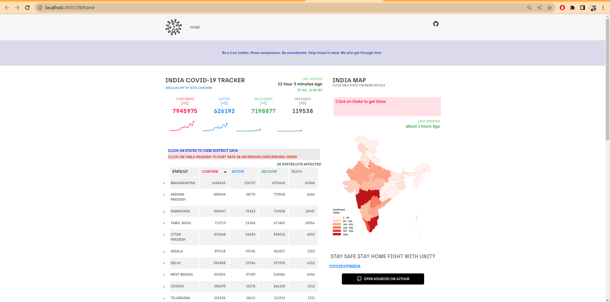
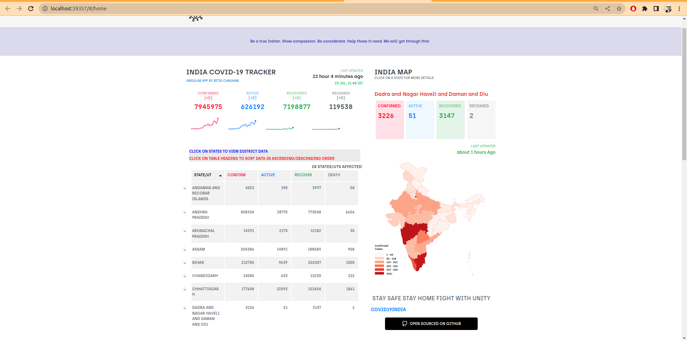

# About

The application shows real-time data for the number of cases of Corona Virus in various States and districts of India. It also shows the increase in no of cases all over the country , increase in a number of cases state wise and district wise. It also show the confirmed cases, active cases, recovered, and total no of deaths. Also, the app has one page named Help Lines which has various helpline numbers and Links. The app has the banner part where some guidelines are displayed continuously and changes every 5 seconds to make people aware, what are safety measures etc.

# Technology Used
Angular9
Typescript
Javascript sorting Functions
Bootstrap

# Key Features of App :
RealTime data of no of cases of Corona Virus
Shows Confirmed Active, Recovered, no of Deaths
Show Data of All affected States
Show data of Affected District of States
Can sort Data in ascending /descending order.
Helpline page for helplines numbers and website Links
The banner part which shows continuously guidelines and preventive measure.
Refreshed Data every 15–30 minutes

# Covoid19

This project was generated with [Angular CLI](https://github.com/angular/angular-cli) version 14.2.6.

## Development server

Run `ng serve` for a dev server. Navigate to `http://localhost:4200/`. The app will automatically reload if you change any of the source files.

## Code scaffolding

Run `ng generate component component-name` to generate a new component. You can also use `ng generate directive|pipe|service|class|guard|interface|enum|module`.

## Build

Run `ng build` to build the project. The build artifacts will be stored in the `dist/` directory. Use the `--prod` flag for a production build.

## Running unit tests

Run `ng test` to execute the unit tests via [Karma](https://karma-runner.github.io).

## Running end-to-end tests

Run `ng e2e` to execute the end-to-end tests via [Protractor](http://www.protractortest.org/).

## Further help

To get more help on the Angular CLI use `ng help` or go check out the [Angular CLI README](https://github.com/angular/angular-cli/blob/master/README.md).

-----------------------
